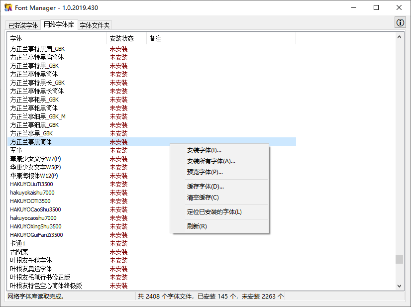

# iHonux

### 欢迎
 **Welcome to iHonux Pages!**  这里分享了近些年来作者进行的一些探索。如果感兴趣朋友可以留言或发电子邮件到 tonyangell@163.com 。

### 视频直播云平台 V3.0
> 视频直播云平台是一款流媒体视频直播运营管理软件，支持rtmp、rtsp、srt、webrtc、hls、hdl视频流的推流、拉流、权限认证、视频流录制、多路推流、流服务器管理和状态监控、日志管理。目前支持两款流行的流媒体服务器软件：nginx、SRS（Simple RTMP Server）。
（2022.2）

### 多路推流软件（Live Stream Publisher）
> 多路推流软件，支持视频流的多路分发，实现拉取rtmp、rtsp、srt、hls、hdl视频流后再通过rtmp、srt协议推流到其他流媒体服务器。实现对推流任务的管理、调度，支持服务器集群以容纳更多的推流任务。基于ffmpeg开发，拉取视频流后将视音频数据二次封装后推流，不进行重新编码，降低CPU使用率。即可以作为客户端软件运行在单机，也可以集成到视频直播云平台中实现对视流频的推流任务的远程管理。
（2022.1）

### 视频流录制软件（Live Stream Recorder）
> 视频流录制软件，支持对rtmp、rstp、srt、hdl、hls等视频流的手动、自动录制保存。即可以作为客户端软件运行在单机，也可以集成到视频直播云平台中实现对视流频的录制任务的远程管理、录制文件的预览和下载。
（2021.2）

### 机房计时管理系统
> 机房计时控制管理软件采用C/S架构，客户端程序和计时统计服务使用Delphi 10.2开发，服务器端使用Apache 2.4.39 + MySQL 5.7.26数据库 + php 7.3.4，通信协议http，数据交换格式JSON。
（2020.2）

- [论文《电视台非编机房计时管理系统的设计与应用》](https://kns.cnki.net/kcms/detail/detail.aspx?dbcode=CJFD&dbname=CJFDLAST2021&filename=DSZM202110015&uniplatform=NZKPT&v=nsPYJJIzNwanzm74g-0HCBpIHnohTHTIqfcgS4h1qJAqgndFxr56264ngJwxJh6i)

### 字体管理软件（Font Manager）
> 一块字体管理软件。采用C/S架构，可以从自行部署的字体服务器下载安装字体到本机；同时可对本机已安装字体进行管理；适合局域网批量安装部署字体。
(2019.5)

### 定时删除程序（DelFileTimer）
> 定时删除指定目录中的文件，可设定文件类型，可设定不删除的子目录，可设定超期天数。运行稳定，适合长时间运行。
（2018.10）

### 网络工作站统一监控与管理系统
> 对局域网中的电脑进行集中管理，可监控客户端资源情况、查看桌面、远程执行命令、实现远程关机等。
（2018.4）

- [论文《非编网络工作站统一监控与管理系统的设计与实现》](https://kns.cnki.net/kcms/detail/detail.aspx?dbcode=CJFD&dbname=CJFDLAST2020&filename=DSZM202002019&uniplatform=NZKPT&v=AiRotHsGSyPfgl8XzIrVR9KQtm0AWYNnm7-fw80GbU2fDRha28R4OW9z41eIWQLF)

### 节目生产网络监控系统
> 电视台节目生产网络监控软件可以实时收集节目生产网络的共享磁盘状态、服务器/工作站状态、服务运行状态等数据，发现异常情况时，通过大屏幕提醒、手机消息等方式通知技术人员。整套软件系统包括五个部分：服务监控客户端、监控分布客户端、信息汇聚服务、提醒服务、网监程序。
（2017.9）

- [论文《台内节目生产网络监控系统的设计与实现》](https://kns.cnki.net/kcms/detail/detail.aspx?filename=DSZM201901019&dbcode=CJFQ&dbname=CJFD2019&v=nObC302BMhD21XqCtCQ9Stk2bf5wgPBgvJ0kQdhJdu14j5CA2wSagVogRMLoMmDP)

### 电脑抽奖程序设计器
> 一款设置灵活、操作简单、功能强大的专业电脑抽奖软件开发工具，经历上千次正式抽奖场合的考验，效果良好。适用于各类抽奖场合。
（2016.12）

- [飞翔电脑抽奖程序设计器快速上手](images/%E9%A3%9E%E7%BF%94%E7%94%B5%E8%84%91%E6%8A%BD%E5%A5%96%E7%A8%8B%E5%BA%8F%E8%AE%BE%E8%AE%A1%E5%99%A8%E5%BF%AB%E9%80%9F%E4%B8%8A%E6%89%8B.png)
- [飞翔电脑抽奖程序设计器之抽奖界面设计](images/%E9%A3%9E%E7%BF%94%E7%94%B5%E8%84%91%E6%8A%BD%E5%A5%96%E7%A8%8B%E5%BA%8F%E8%AE%BE%E8%AE%A1%E5%99%A8%E4%B9%8B%E6%8A%BD%E5%A5%96%E7%95%8C%E9%9D%A2%E8%AE%BE%E8%AE%A1.png)
- [如何通过平板电脑远程遥控抽奖程序？](images/%E5%A6%82%E4%BD%95%E9%80%9A%E8%BF%87%E5%B9%B3%E6%9D%BF%E7%94%B5%E8%84%91%E8%BF%9C%E7%A8%8B%E9%81%A5%E6%8E%A7%E6%8A%BD%E5%A5%96%E7%A8%8B%E5%BA%8F%EF%BC%9F.png)
- [论文《电视抽奖程序设计软件的开发与应用》](https://kns.cnki.net/kcms/detail/detail.aspx?filename=OGSA201307001017&dbcode=CPFD&dbname=CPFD2016&v=3fxURWWI5VcqDJpKX7f9Onu79yoXJUZiEoLnCYdOwt93YvgSi0_xAwpSJD-ApVvn6NWGwBRFubM=)

### 多媒体展示系统
> 一种以信息输出播放为目的，以信息发布传递为主导的软件系统。它通过将文本，图片，动画，视频，音频有机组合，实时的形成一段段连续的画面，并通过现有的各种显示设备，播放给人们观看，向人们传达各种宣传信息。它采用了C/S结构，主从式体系，借助于现有的通讯网络，将信息传送到网络内的任何地方并播放输出。
（2014.3）[更多详情](images/%E9%A3%9E%E7%BF%94%E5%A4%9A%E5%AA%92%E4%BD%93%E5%B1%95%E7%A4%BA%E7%B3%BB%E7%BB%9F.png)